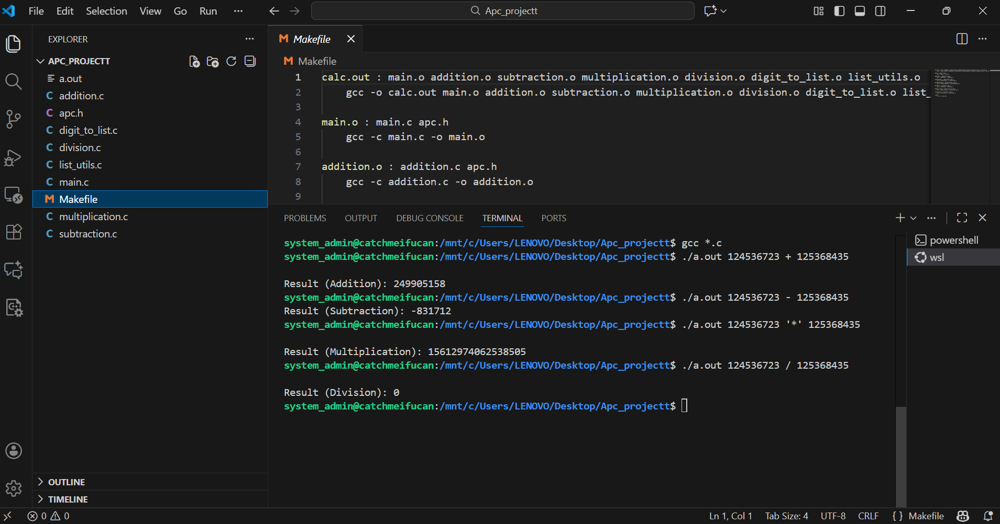

# APC – Arbitrary Precision Calculator

## Author
Om Bidikar

---

## About the Project

This project implements a Big Integer Calculator that performs arithmetic operations on numbers larger than standard data types like int or long long.

Each digit is stored in a Doubly Linked List, allowing efficient handling of arbitrarily large integers.

---

## Features

- Addition
- Subtraction
- Multiplication
- Division
- Conversion of input digits into linked list
- Utility functions (insert, compare, free, print)

---

## 📁 Project Structure

Apc_projectt/

Source Files:
- main.c
- addition.c
- subtraction.c
- multiplication.c
- division.c
- digit_to_list.c
- list_utils.c

Header File:
- apc.h

Build:
- Makefile

Documentation:
- README.md

---

## ⚙️ How to Compile

make

This generates:
calc.out

---

## ▶️ How to Run

./calc.out <num1> <operator> <num2>

Example:
./calc.out 12345 + 6789

Output:
Result (Addition): 19134

---

## 🧪 Examples

Addition:
./calc.out 98765 + 555  
Result: 99320  

Subtraction:
./calc.out 5000 - 345  
Result: 4655  

Multiplication:
./calc.out 123 * 456  
Result: 56088  

Division:
./calc.out 100 / 5  
Result: 20  

---

## 📸 Output Screenshot

The following screenshot demonstrates all arithmetic operations:

---

## 💡 Key Data Structure: Doubly Linked List

typedef struct node {
    struct node *prev;
    int data;
    struct node *next;
} Dlist;

Each digit of a number is stored as a node in the list.

---

## 🧠 Concepts Used

- Doubly Linked Lists
- Dynamic Memory Allocation
- Pointer Manipulation
- Modular Programming in C

---

## ⚠️ Limitations

- Only integer arithmetic supported
- No floating-point operations
- Limited input validation

---

## 🧹 Clean Build

make clean

Removes .o files and executable.

---

## 📘 License

This project is open-source and can be used for learning purposes.
